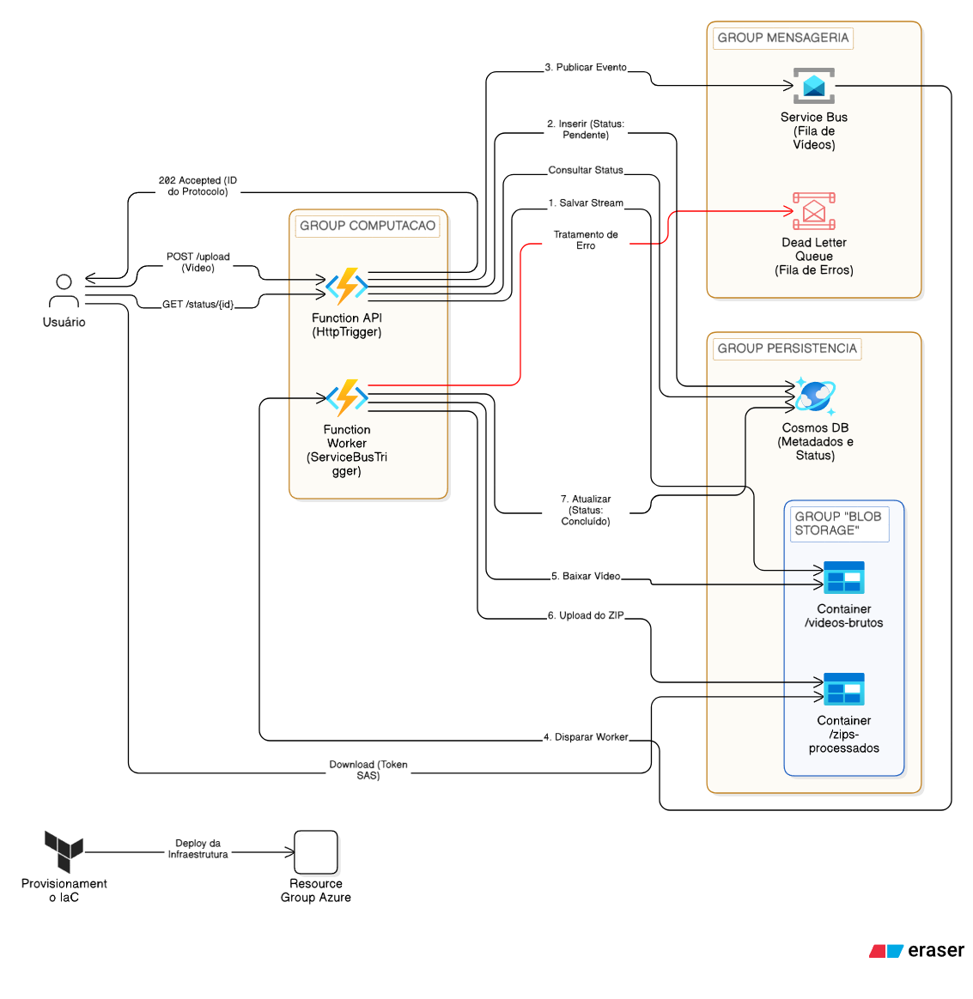

# FiapX - Video Processing Platform (Serverless & Distributed)

Este projeto representa o **Tech Challenge Final** da Pós-graduação em Arquitetura de Software da **FIAP**. O **FiapX** é uma solução escalável para processamento assíncrono de vídeos, convertendo arquivos brutos em coleções de frames compactadas, utilizando o que há de mais moderno em ambiente Cloud Native na Azure.

---

## 🏗️ Arquitetura do Sistema

A solução foi desenhada seguindo os princípios da **Clean Architecture**, garantindo que a lógica de negócio seja independente de frameworks, bancos de dados ou agentes externos.

### 1. Camadas da Solução (Clean Arch)
* **Core (Domain):** Contém as entidades de negócio (User, Video, Batch) e as interfaces fundamentais.
* **Application:** Onde residem os **Use Cases**. Toda a orquestração da lógica de negócio (ex: `ProcessVideoUseCase`) acontece aqui, sem acoplamento com a infraestrutura.
* **Infrastructure:** Implementações de acesso a dados (EF Core + Cosmos DB), mensageria (Service Bus), armazenamento (Blob Storage) e notificações (Azure Communication Services).
* **Presentation (API & Worker):** Camada de interface com o mundo externo, utilizando **Azure Functions (.NET 8 Isolated)**.

### 2. Arquitetura Geral

O diagrama a seguir ilustra a arquitetura geral do sistema, destacando as interações entre os componentes e os fluxos de dados:

---

## 🔄 Saga Orquestrada

Para garantir a consistência dos dados em um ambiente distribuído, implementamos o padrão de **Saga Orquestrada** baseada em eventos:

1.  **Ingestão (API):** O usuário faz o upload do vídeo. A API salva o estado inicial no **Cosmos DB** e publica um evento no **Azure Service Bus**.
2.  **Processamento (Worker):** O Worker (Trigger de Fila) consome a mensagem, baixa o vídeo do **Blob Storage**, utiliza o **FFmpeg** para extração de frames e gera um arquivo `.zip`.
3.  **Finalização:** O Worker atualiza o status do lote no banco de dados e aciona o serviço de **E-mail (ACS)** para notificar o usuário sobre a conclusão ou falha.

---

## ☁️ Infraestrutura como Código (Terraform)

Toda a infraestrutura foi provisionada de forma automatizada, garantindo que o ambiente de produção seja idêntico ao de desenvolvimento.

* **Serverless Compute:** Azure Functions no plano Linux Consumption (Y1).
* **NoSQL Data:** Cosmos DB para alta disponibilidade e escalabilidade global.
* **Async Messaging:** Service Bus para desacoplamento total entre API e Worker.
* **Object Storage:** Blob Storage para armazenamento seguro de arquivos binários.

---

## 🚀 DevOps & CI/CD

O pipeline de deploy via **GitHub Actions** foi otimizado para superar os desafios de pacotes no Linux Consumption.

## 🛠️ Tecnologias Utilizadas

* **.NET 8 (Isolated Worker Process)**
* **Entity Framework Core (Cosmos Provider)**
* **FFmpeg (Processamento de Imagem)**
* **Terraform (IaC)**
* **Azure Service Bus & Blob Storage**
* **Azure Communication Services (E-mail)**
* **JWT (Authentication & Authorization)**

---

## 👨‍💻 Autor

**Raphael Nascimento de Araújo Silva** *Software Architect - FIAP*

---
> "Este projeto é o resultado de uma jornada de aprendizado sobre resiliência, escalabilidade e os desafios reais de arquitetar sistemas distribuídos na nuvem."

## ❤️ Agradecimentos

A conclusão desta jornada na **FIAP** não é apenas uma conquista individual, mas o resultado de um esforço coletivo e de muito suporte de pessoas fundamentais.

* **Aos mestres e colegas da FIAP:** Pelo compartilhamento exaustivo de conhecimento e pelos feedbacks que moldaram minha visão como Arquiteto de Software.
* **À comunidade de desenvolvedores:** Pelo espírito de colaboração global que nos inspira a resolver problemas complexos e a evoluir um commit de cada vez.
* **À minha família:** Pelo apoio incondicional e por serem o alicerce que me permitiu focar e persistir nos momentos de maior desafio técnico.

**Um agradecimento especial à minha esposa:** Minha maior incentivadora, parceira de vida e a verdadeira força motriz por trás deste projeto. Sem o seu apoio, paciência e motivação constante, este ciclo não teria se fechado com tanta excelência. Obrigado por estar ao meu lado em cada passo desta jornada e por acreditar no meu potencial, mesmo quando as madrugadas de código pareciam não ter fim. Este projeto também é seu! ❤️